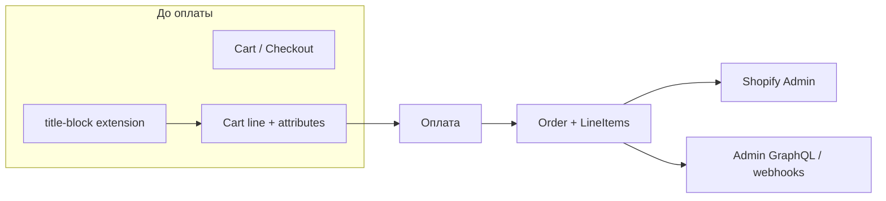

# След гарантии в заказе

Документ для тех, кто впервые работает с Shopify и с checkout extension `title-block` в этом репозитории.

**Задача:** после оформления заказа мерчант должен видеть, что гарантия добавлена **через upsell-блок в checkout**, а не тем же способом, что если покупатель сам положил товар гарантии в корзину на витрине.

---

## 1. Что такое заказ (Order)

**Корзина (cart)** — то, что покупатель собирает до оплаты: позиции (variants), количество, скидки.

**Checkout** — страница оформления: адрес, доставка, оплата. Checkout UI extension (наш `title-block`) работает **здесь**, до создания заказа.

**Заказ (Order)** — запись в Shopify после успешной оплаты. В заказе есть:

- **Line items** — позиции (какие товары/variants, qty, цена);
- клиент, адреса, доставка, налоги, статусы fulfillment;
- дополнительные поля: note, custom attributes на уровне заказа, metafields (если app их пишет).

Важно для разработки extension:

- Extension **не создаёт** заказ и **не пишет** в него напрямую после оплаты.
- Всё, что должно «переехать» в заказ как метка на **конкретной позиции**, нужно **записать в cart/checkout до оплаты** (чаще всего — attributes на cart line).
- Альтернатива — app backend по webhook `orders/create` и запись order metafields; для «источник этой строки гарантии» это избыточно.



---

## 2. Где в заказе хранится «след»

«След» — произвольная пара **ключ → значение**, которую ты контролируешь, чтобы потом отличить сценарии (upsell vs витрина, gift wrap, engraving и т.д.).

### Сравнение механизмов

| Механизм | Уровень | Кто пишет из checkout UI | Где видит мерчант | Подходит для title-block |
|----------|---------|---------------------------|-------------------|---------------------------|
| **Cart line attributes** | одна позиция в корзине | `applyCartLinesChange` (`addCartLine` / `updateCartLine`) | Admin → заказ → позиция (properties / custom attributes) | **Да** |
| **Cart / checkout attributes** | весь заказ | `applyAttributeChange` | Admin → additional details / note attributes | Нет (нет привязки к строке гарантии) |
| **Order note** | весь заказ | покупатель, тема, редко extension | Поле Note в заказе | Плохо для автоматизации и фильтров |
| **Order metafields** | заказ (или line item через API) | app backend после `orders/create` | Metafields в admin / API | Избыточно для простой метки на строке |

Официальная документация:

- [Cart Lines API — `CartLineAddChange.attributes`](https://shopify.dev/docs/api/checkout-ui-extensions/2026-07/target-apis/checkout-apis/cart-lines-api) — как extension добавляет строку с attributes.
- [Admin GraphQL — `Attribute` / `LineItem.customAttributes`](https://shopify.dev/docs/api/admin-graphql/2026-07/objects/Attribute) — как это выглядит в API заказа.
- [Cart API — private line item properties (`_key`)](https://shopify.dev/docs/api/ajax/reference/cart) — та же модель key/value на витрине; в checkout extension используются **cart line attributes**, которые на заказе становятся properties / custom attributes.

### Термины (чтобы не путаться)

| В checkout extension | На витрине (Ajax Cart) | В заказе (Admin / GraphQL) |
|----------------------|-------------------------|----------------------------|
| cart line `attributes` | line item `properties` | line item properties / `customAttributes` |

Shopify в доках для Functions пишет: *cart line attributes equivalent to line_item properties in Liquid* — смысл один: метаданные **на позиции**, не на всём заказе.

---

## 3. Design для `title-block` (контракт)

Константы: [`warranty-trace.ts`](../extensions/title-block/src/pure-model/warranty-trace.ts). Подключение: [`use-add-warranty.tsx`](../extensions/title-block/src/model/use-add-warranty.tsx) передаёт `attributes` в `addCartLine`.

### Рекомендуемые attributes при добавлении через блок

При `applyCartLinesChange({ type: 'addCartLine', ... })` добавить массив `attributes`:

| Ключ | Значение | Зачем |
|------|----------|--------|
| `_warranty_source` | `title-block` | Машиночитаемая метка; ключ с `_` — [private property](https://shopify.dev/docs/api/ajax/reference/cart): обычно не показывается покупателю на витрине, **в админке на позиции виден** |
| `Warranty source` (опционально) | `Checkout upsell` | Человекочитаемая подпись для мерчанта в UI без знания внутреннего ключа |

Пример (псевдокод для будущей реализации):

```ts
await applyCartLinesChange({
  type: 'addCartLine',
  merchandiseId: variantGid,
  quantity: 1,
  attributes: [
    { key: '_warranty_source', value: 'title-block' },
    { key: 'Warranty source', value: 'Checkout upsell' },
  ],
});
```

### Правило интерпретации

| В заказе на строке гарантии | Значение |
|-----------------------------|----------|
| Есть `_warranty_source` = `title-block` | Гарантия добавлена через checkout extension `title-block` |
| Тот же variant, атрибута нет | Гарантия попала в корзину другим путём (витрина, cart drawer, другой app и т.д.) |

### Ограничения

- Метка ставится **в момент** `addCartLine` из extension. Если variant гарантии уже лежит в корзине **без** атрибута, extension не знает, откуда он взялся, и **не должен** молча приписывать upsell.
- Если понадобится «дотянуть» метку до уже существующей строки — только явный `updateCartLine` по текущему `line.id`; [ID cart line нестабилен](https://shopify.dev/docs/api/checkout-ui-extensions/2026-07/target-apis/checkout-apis/cart-lines-api) между операциями, его нельзя сохранять надолго.
- Две отдельные строки с одним variant (qty 1 + qty 1) — у каждой свой набор attributes; это нормально для сценария «одна с витрины, одна из блока».

---

## 4. Где найти след после оформления

### Merchant Admin (UI)

1. **Orders** → выбрать заказ.
2. В списке товаров найти позицию гарантии.
3. Открыть детали позиции — блок **Properties**, **Custom attributes** или аналог (формулировки в admin могут слегка отличаться по версии).

Ищи `_warranty_source` / `Warranty source`.

### Разработчик: Admin GraphQL

Пример запроса (API `2026-07`):

```graphql
query OrderLineAttributes($id: ID!) {
  order(id: $id) {
    name
    lineItems(first: 50) {
      nodes {
        title
        customAttributes {
          key
          value
        }
      }
    }
  }
}
```

`$id` — GID заказа, например `gid://shopify/Order/123456789`.

### Webhooks и интеграции

Подписка на [`orders/create`](https://shopify.dev/docs/api/webhooks) (или `orders/paid`): в payload line items часто содержат properties / custom attributes — удобная точка для ERP, WMS, fulfillment rules («обрабатывать upsell-гарантию иначе»).

### До оплаты: отладка в extension

В checkout sandbox можно проверить, что метка записалась:

```js
shopify.lines.value.forEach((line) => {
  console.log(line.merchandise?.id, line.attributes);
});
```

Или подписка: `shopify.lines.subscribe(...)`.

---

## 5. Связь с текущим кодом extension

| Файл | Роль |
|------|------|
| [`Checkout.jsx`](../extensions/title-block/src/compose/Checkout.jsx) | UI блока; скрывает блок, если нет карточки, гарантия уже «добавлена» или в корзине нет товара с `warranty_days` |
| [`use-has-warranty-days-in-cart.tsx`](../extensions/title-block/src/model/use-has-warranty-days-in-cart.tsx) | Показывать upsell только если в корзине есть продукт с app metafield `$app:custom` / `warranty_days` |
| [`use-warranty-added.tsx`](../extensions/title-block/src/model/use-warranty-added.tsx) | Считает, что гарантия уже в корзине, если **любая** line с нужным `variantGid` — **без** проверки attributes |
| [`use-add-warranty.tsx`](../extensions/title-block/src/model/use-add-warranty.tsx) | Добавляет variant с `WARRANTY_TRACE_LINE_ATTRIBUTES` |

Разделение ответственности:

- **UI checkout:** «кнопку уже не показываем» = variant уже в lines (любой источник).
- **Заказ после оплаты:** источник различаем **только** по line attributes по контракту из раздела 3.

---

## 6. Чеклист ручной проверки

Подготовка:

- Dev store с Checkout Extensibility.
- Товар в корзине с заполненным metafield `warranty_days` (namespace `$app:custom` — см. [`shopify.extension.toml`](../extensions/title-block/shopify.extension.toml)).
- В настройках блока в Checkout Editor указан **Product variant** гарантии.

Сценарии:

| # | Действие | Ожидание в заказе |
|---|----------|-------------------|
| A | Только через `title-block` → Add → оплата | На строке гарантии: `_warranty_source` = `title-block` |
| B | Тот же variant только с витрины → checkout → оплата | На строке гарантии **нет** `_warranty_source` |
| C | Сначала витрина, потом checkout без повторного add в блоке | Блок скрыт (`use-warranty-added`); в заказе — как B |

---

## 7. Опционально

Уточнить [`use-warranty-added.tsx`](../extensions/title-block/src/model/use-warranty-added.tsx) — считать «added через блок» только при `lineHasWarrantyUpsellTrace(line.attributes)` (отдельное UX: variant с витрины снова покажет upsell).

API version проекта: **2026-07** ([`shopify.extension.toml`](../extensions/title-block/shopify.extension.toml)).
