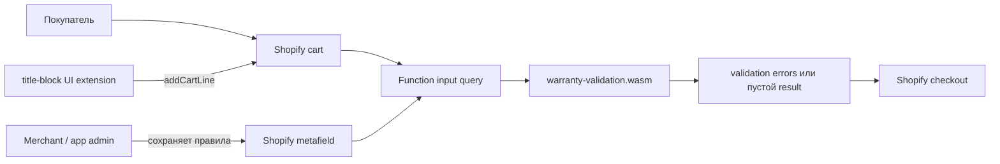

# Shopify Functions в `task-03`

## Коротко

**Shopify Function** — серверное расширение Shopify: небольшой детерминированный модуль, который Shopify компилирует в WebAssembly и запускает внутри своих checkout/cart-процессов.

Function не является:

- React-компонентом;
- route нашего backend;
- webhook handler;
- HTTP endpoint, который можно вызвать вручную;
- заменой Checkout UI Extension.

Shopify сам вызывает Function в подходящий момент. Например, при пересчёте корзины, выборе доставки, проверке checkout или вычислении скидки.

В текущем приложении **Shopify Functions пока нет**. Есть Checkout UI Extension:

```text
extensions/title-block/
```

`title-block` рисует upsell гарантии и по клику добавляет variant в корзину. Эта логика выполняется в checkout-клиенте. Function выполнялась бы на backend Shopify и могла бы независимо проверять или преобразовывать корзину.

## Где Function подходит этому приложению

Самый понятный пример — `warranty-validation` на API **Cart and Checkout Validation**.

Она могла бы запрещать продолжение checkout, если:

- в корзине есть гарантия, но нет товара с `warranty_days > 0`;
- количество гарантий превышает количество подходящих товаров;
- variant гарантии не соответствует конфигурации приложения.

Это не дублирование UI. Ответственность разная:

```text
title-block                 warranty-validation
-------------------------  -----------------------------------
Показывает предложение     Защищает бизнес-правило
Работает в checkout UI     Работает внутри Shopify
Добавляет cart line        Проверяет итоговое состояние cart
Улучшает UX                Не доверяет конкретному UI/каналу
Может быть обойдён         Срабатывает для поддерживаемых каналов
```

Другие возможные Functions для этого проекта:

- **Discount** — скидка на гарантию при наличии подходящего товара;
- **Cart Transform** — представить основной товар и гарантию как bundle;
- **Cart and Checkout Validation** — проверять совместимость гарантии и основного товара.

Function не сможет сама вызвать backend приложения, читать Prisma или произвольно удалить строку корзины. Для простой гарантии данные лучше заранее передавать через Shopify metafields.

## Предлагаемая структура репозитория

Function создаётся только через Shopify CLI, а не вручную:

```bash
shopify app generate extension --template cart_checkout_validation --flavor rust --name=warranty-validation
```

После генерации структура будет примерно такой:

```text
task-03/
├─ app/
│  ├─ routes/
│  │  └─ app.warranty-rules.jsx         # опциональный UI управления правилами
│  ├─ services/
│  │  └─ warranty-function.server.js    # опциональный Admin GraphQL CRUD
│  └─ shopify.server.js                 # OAuth/Admin API, не runtime Function
├─ extensions/
│  ├─ title-block/                      # текущий Checkout UI Extension
│  └─ warranty-validation/              # отдельный Function Extension
│     ├─ shopify.extension.toml         # API version, target, export, build
│     ├─ schema.graphql                 # схема Function API от Shopify
│     ├─ Cargo.toml                     # Rust package
│     └─ src/
│        ├─ main.rs                     # Wasm entry point и регистрация target
│        ├─ cart_validations_generate_run.rs
│        └─ cart_validations_generate_run.graphql
├─ shopify.app.toml                     # app config, scopes, app-owned data
└─ package.json                         # общие команды Shopify CLI
```

Точные имена генерируемых файлов зависят от target и версии CLI. Источник истины — `target`, `input_query` и `export` в сгенерированном `shopify.extension.toml`.

### Что лежит в Function Extension

`shopify.extension.toml`
: Описывает Function как часть приложения: API version, Function target, GraphQL input query, Wasm export и команду сборки.

`schema.graphql`
: Полная схема доступного input и допустимого output для выбранного Function API. Поля нельзя придумывать. После смены API version схему и типы нужно перегенерировать.

`src/*generate_run.graphql`
: Минимальный запрос входных данных. Shopify выполняет этот запрос перед Function и передаёт результат в Wasm. Здесь для гарантии понадобятся cart lines, variant/product identifiers и `warranty_days`.

`src/*generate_run.rs`
: Чистая бизнес-логика: принимает сгенерированный тип input и возвращает строго типизированный result.

`src/main.rs`
: Регистрирует query/target и является entry point Rust-модуля.

Backend в `app/`
: Не участвует в каждом выполнении Function. Он нужен, если приложение само создаёт, настраивает, включает или выключает function owner через Admin GraphQL.

## Как данные проходят через систему



Критично: настройки `extensions/title-block/shopify.extension.toml` не становятся автоматически доступны Function. Сейчас variant гарантии задаётся setting-ом `variant` конкретного UI-блока. Function этого setting-а не увидит.

Чтобы UI и Function не расходились, лучше сделать единый источник конфигурации:

1. app-owned shop metafield с GID variant гарантии и правилами; или
2. JSON metafield на function owner.

Для этого проекта практичнее app-owned shop metafield: backend записывает его один раз, а оба extension читают одно значение. JSON metafield function owner полезнее, если у мерчанта может быть несколько независимых наборов validation rules.

`custom.warranty_days` уже объявлен в корневом `shopify.app.toml`. Function сможет запросить это поле у продуктов через свой input query; Prisma для этого не нужен.

## Две части управления Function

### 1. Код Function

Управляется как extension в `extensions/warranty-validation/`:

- target и API version — `shopify.extension.toml`;
- доступные данные — `*.graphql`;
- алгоритм — `*.rs`;
- unit tests — рядом с Rust-модулем;
- fixtures для локального запуска — внутри Function extension.

### 2. Function owner

Задеплоенная Function — только доступный тип логики. Чтобы она реально применялась, в магазине обычно нужен **function owner**: скидка, validation, cart transform или другой ресурс, который ссылается на Function.

Owner:

- создаётся мерчантом в Shopify Admin либо backend приложения через Admin GraphQL;
- содержит состояние `active/disabled` и настройки конкретного магазина;
- может хранить configuration metafield;
- живёт в Shopify, а не в Prisma этого репозитория.

Для app-managed сценария в Function config отключают самостоятельное создание owner мерчантом:

```toml
[extensions.ui]
enable_create = false
```

Тогда route вроде `app/routes/app.warranty-rules.jsx` показывает форму, а server-side action вызывает соответствующую Admin GraphQL mutation и пишет configuration metafield. Конкретная mutation и необходимые scopes зависят от выбранного Function API.

Prisma стоит использовать только для данных, которых нет смысла хранить на Shopify: внутренний аудит, billing state, служебные связи. Runtime-конфигурацию Function лучше держать в Shopify metafield, иначе Wasm её не прочитает.

## Жизненный цикл

1. CLI генерирует Function Extension.
2. Разработчик задаёт input query, логику и тесты.
3. `shopify app dev` собирает draft Function и связывает его с dev store.
4. В магазине создаётся/активируется function owner.
5. Покупатель меняет cart или проходит checkout.
6. Shopify формирует input по GraphQL query и запускает Wasm.
7. Function возвращает result; Shopify применяет его.
8. `shopify app deploy` публикует новую app version вместе с Function.

Function нельзя вызвать по URL. Для локального теста используется CLI:

```bash
cd extensions/warranty-validation
shopify app function build
shopify app function run --input=input.json --export=<export-из-shopify.extension.toml>
```

Для интеграционной разработки:

```bash
cd ../..
shopify app dev
shopify app logs sources
shopify app logs --source extensions.warranty-validation
```

CLI в dev mode пересобирает Function при изменениях. Конкретное выполнение можно воспроизвести локально через `shopify app function replay`.

## Ограничения, которые влияют на дизайн

- Function должна быть детерминированной: без текущего времени и random.
- Обычный `run` target не ходит в сеть и не читает filesystem/Prisma.
- Network access есть только у отдельных API/target и имеет отдельные ограничения; для этого кейса он не нужен.
- Input определяется только GraphQL query из Function extension.
- Output обязан точно соответствовать schema выбранного target.
- Shopify жёстко ограничивает Wasm binary, память, инструкции и logs.
- Логи ограничены примерно 1 kB; в Rust используется `log!`, не stdout.
- Function должна корректно работать с большой корзиной, поэтому input query должен запрашивать только нужные поля.
- Function code нельзя динамически редактировать и исполнять из merchant UI.

## Версии API в этом репозитории

Сейчас версии не полностью единообразны:

- Checkout UI Extension: `2026-07`;
- backend Admin API: `2026-07`;
- webhooks в `shopify.app.toml`: `2026-10`.

Для первой Function разумно начать с `2026-07`, чтобы совпасть с checkout extension и backend. Version задаётся отдельно в `extensions/warranty-validation/shopify.extension.toml`. Обновление root app config не обновляет Function schema автоматически.

При повышении версии Function API:

1. изменить `api_version` в Function `shopify.extension.toml`;
2. выполнить генерацию schema;
3. выполнить type generation;
4. собрать Function;
5. прогнать unit и fixture tests;
6. проверить draft на dev store.

## Что потребуется изменить при реальной реализации

1. Сгенерировать `extensions/warranty-validation/` командой CLI.
2. Выбрать единый источник GID variant гарантии вместо изолированного setting-а `title-block`.
3. Добавить input query для cart lines, merchandise и `warranty_days`.
4. Реализовать validation result и unit tests.
5. При app-managed owner добавить route/service в `app/`.
6. Добавить только те OAuth scopes, которые реально требует mutation выбранного API.
7. Активировать owner на dev store и проверить сценарии:
   - основной товар без гарантии;
   - основной товар + одна гарантия;
   - гарантия без подходящего товара;
   - несколько товаров/гарантий;
   - variant гарантии, добавленный не через `title-block`.

## Официальная документация

- [About Shopify Functions](https://shopify.dev/docs/apps/build/functions)
- [Function APIs 2026-07](https://shopify.dev/docs/api/functions/2026-07)
- [Create a cart and checkout validation](https://shopify.dev/docs/apps/build/checkout/cart-checkout-validation/create-checkout-validation)
- [Test and debug Shopify Functions](https://shopify.dev/docs/apps/build/functions/test-debug-functions)
- [Metafields for Function input queries](https://shopify.dev/docs/apps/build/functions/input-queries/metafields-for-input-queries)
- [Network access for Shopify Functions](https://shopify.dev/docs/apps/build/functions/network-access)
